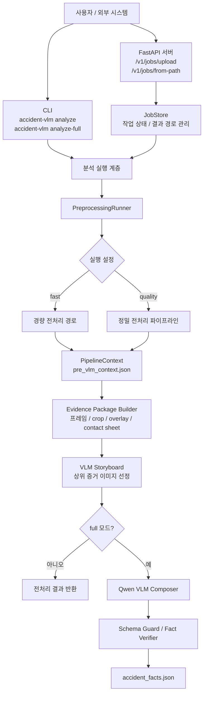
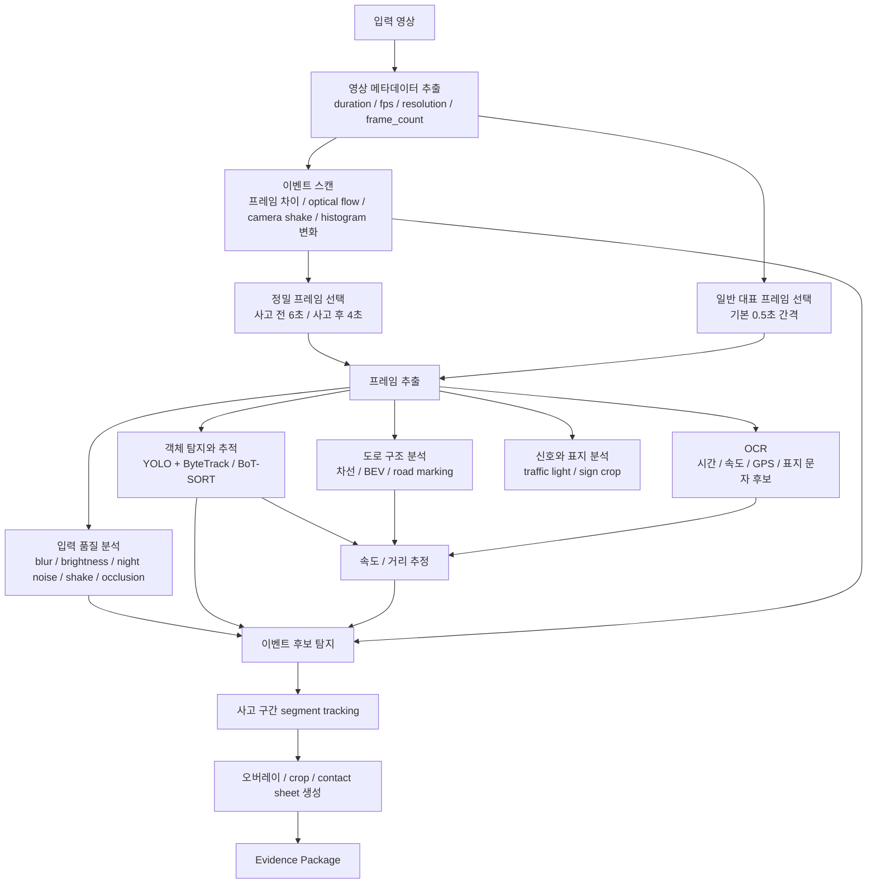
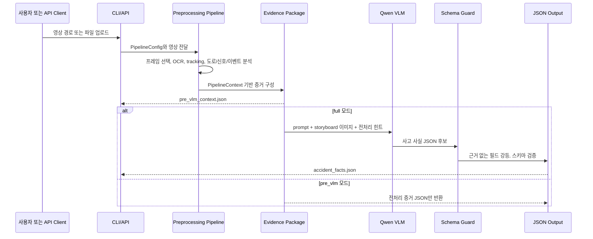
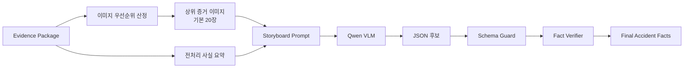
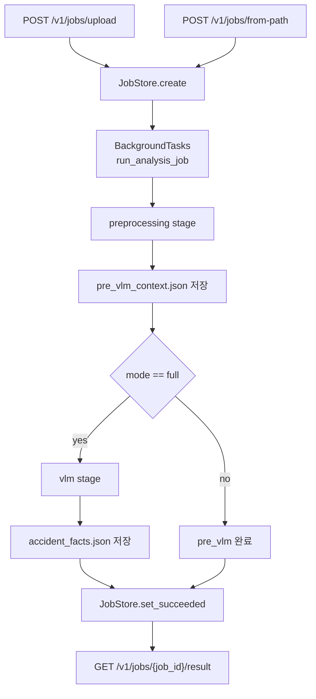

# Accident VLM 아키텍처 문서

`accident-vlm`은 블랙박스 사고 영상에서 법적 판단이 아닌 객관 사실과 근거를 추출하고, 이후 RAG나 보험/법률 검토 시스템이 사용할 수 있는 구조화 JSON을 만드는 영상 분석 파이프라인입니다. 이 문서는 시스템의 실행 경로, 전처리 파이프라인, 증거 구성 방식, VLM 합성 전략, 검증 구조를 정리합니다.

## 1. 프로젝트 목표

`accident-vlm`은 사고 영상을 직접 결론으로 바꾸지 않습니다. 먼저 영상에서 확인 가능한 프레임, 객체, 도로 구조, 신호, OCR, 이벤트 후보를 수집하고, 그 근거만 사용해 최종 사고 사실 JSON을 생성합니다.

설계 원칙은 다음과 같습니다.

| 원칙 | 설명 |
| --- | --- |
| 근거 우선 | 모든 주요 판단은 프레임, crop, overlay, OCR, track 같은 evidence를 참조합니다. |
| 보수적 추론 | 확인되지 않는 값은 추측하지 않고 `확인불가` 또는 `unknown`으로 남깁니다. |
| 법적 판단 배제 | 과실 비율, 위반 여부, 가해자/피해자, 책임 소재는 출력하지 않습니다. |
| 모듈 분리 | 전처리, 증거 구성, VLM 합성, API 실행을 분리해 테스트와 교체가 쉽도록 했습니다. |
| 품질 우선 | 기본 설정은 속도보다 정확도를 우선하며, 사고 전후 구간을 더 촘촘히 분석합니다. |

## 2. 전체 아키텍처

아키텍처는 `CLI/API -> 실행 계층 -> 전처리 -> 증거 패키지 -> VLM 합성 -> 검증 -> JSON 출력` 흐름으로 구성됩니다. CLI와 API는 진입점만 다르고, 핵심 분석 로직은 같은 파이프라인을 재사용합니다.

## 3. 주요 컴포넌트

| 계층 | 주요 파일 | 책임 |
| --- | --- | --- |
| CLI | `src/accident_vlm/cli.py` | 로컬 명령어로 `pre_vlm` 또는 `full` 분석 실행 |
| API | `src/accident_vlm/server/app.py` | 영상 업로드, 서버 경로 분석, 작업 상태 조회, 결과 조회 |
| Job 실행 | `src/accident_vlm/server/runner.py` | API 옵션을 `PipelineConfig`로 변환하고 작업 상태를 갱신 |
| 서비스 경계 | `src/accident_vlm/services/preprocessing.py`, `src/accident_vlm/services/vlm.py` | 전처리 실행과 VLM 실행을 분리 |
| 파이프라인 조립 | `src/accident_vlm/pipeline.py` | 프레임 선택, OCR, tracking, 도로/신호/이벤트 분석 순서 제어 |
| 전처리 모듈 | `src/accident_vlm/modules/*.py` | 영상 품질, OCR, 객체 추적, 도로 기하, 신호/표지, 이벤트 후보, 증거 이미지 생성 |
| 스키마 | `src/accident_vlm/schemas/*.py` | 전처리 컨텍스트와 최종 출력 계약 정의 |
| VLM 합성 | `src/accident_vlm/modules/vlm_composer.py` | Qwen 입력 prompt와 이미지 목록 구성, JSON 생성, fallback 처리 |
| 검증 | `src/accident_vlm/modules/schema_guard.py`, `src/accident_vlm/modules/fact_verifier.py` | 근거 없는 최종 필드를 unknown으로 강등하고 법적 판단 표현 제거 |

## 4. 전처리 파이프라인 상세

정밀 모드의 핵심은 전체 영상을 그대로 VLM에 넣지 않고, 사고 판단에 필요한 증거를 먼저 선별하는 것입니다.

이 구조는 비용이 큰 VLM 호출 전에 deterministic/heuristic CV 분석으로 후보와 증거를 좁힙니다. 덕분에 VLM은 전체 영상이 아니라 사고 설명에 필요한 핵심 이미지를 읽게 됩니다.

## 5. 데이터 흐름

주요 산출물은 두 가지입니다.

| 산출물 | 설명 |
| --- | --- |
| `pre_vlm_context.json` | VLM 호출 전까지의 모든 전처리 결과와 증거 패키지 |
| `accident_facts.json` | Qwen VLM과 검증 단계를 거친 최종 사고 사실 JSON |

## 6. 핵심 스키마와 증거 연결

전처리 결과는 `PipelineContext`에 누적됩니다.

| 필드 | 의미 |
| --- | --- |
| `video_metadata` | 영상 길이, FPS, 해상도, 프레임 수 |
| `input_quality` | 흐림, 밝기, 야간 노이즈, 흔들림, 가림, 분석 신뢰도 |
| `selected_frames` | VLM과 전처리에 사용할 대표/이벤트 프레임 |
| `ocr_observations`, `ocr_summary` | OCR 원문, crop, 파싱 결과, temporal voting 요약 |
| `tracks` | 객체별 위치 변화, confidence, track 품질 |
| `road_geometry` | 차선, road marking, BEV confidence, 차로 수 후보 |
| `speed_and_distance` | OCR 속도, tracking, BEV를 조합한 거리/속도 후보 |
| `traffic_control` | 신호등, 좌회전 신호, 표지판 후보와 crop |
| `event_candidates` | 충돌, 급정지, 방향 변화, 비접촉 사고 후보 |
| `overlays`, `crops`, `contact_sheets` | 사람이 검토할 수 있는 시각 증거 |
| `evidence_package` | VLM 입력과 최종 JSON citation에 쓰이는 통합 증거 묶음 |

최종 JSON은 가능한 한 `value`, `status`, `confidence`, `source`, `evidence`, `note` 형태를 유지합니다. 이 방식은 “왜 그런 결론이 나왔는가”를 사람이 역추적할 수 있게 만듭니다.

## 7. VLM 합성 전략

Qwen VLM은 단순히 영상을 보고 자유롭게 요약하지 않습니다. 시스템은 먼저 전처리 결과와 증거 이미지를 storyboard로 정렬하고, VLM에게 다음 제약을 부여합니다.

- 영상에 없는 사실은 `확인불가`로 유지합니다.
- 법적 판단, 과실 비율, 위반 여부, 가해자/피해자 표현을 금지합니다.
- 주요 이벤트, actor, collision claim은 반드시 evidence를 인용합니다.
- pedestrian, motorcycle, bicycle, traffic signal 같은 사고 핵심 단서는 crop/overlay에만 보여도 후보로 유지합니다.
- JSON 파싱 실패나 CUDA OOM이 발생하면 이미지 수 축소, compact prompt, 보수적 fallback payload로 재시도합니다.

## 8. 신뢰도와 불확실성 처리

사고 영상 분석은 조명, 흔들림, 가림, 낮은 해상도에 취약합니다. 이 프로젝트는 불확실성을 숨기지 않고 결과에 포함합니다.

| 상황 | 처리 방식 |
| --- | --- |
| 영상 품질이 낮음 | `input_quality.analysis_reliability`와 `preprocessing_uncertainties`에 기록 |
| 객체 추적이 끊김 | track quality, fragmentation, uncertainty reason 저장 |
| 신호나 표지가 작거나 빛 번짐이 있음 | crop과 failure reason을 저장하고 confidence를 낮춤 |
| VLM이 근거 없는 값을 생성 | schema guard와 fact verifier가 `unknown` 또는 `확인불가`로 강등 |
| JSON 생성 실패 | 전처리 근거 기반 fallback JSON을 생성하고 실패 이유를 uncertainty에 기록 |

이 설계 덕분에 downstream RAG는 결과를 맹신하지 않고, 필드별 신뢰도와 근거를 함께 사용할 수 있습니다.

## 9. API 실행 구조

API는 비동기 작업 큐처럼 동작합니다. 사용자는 영상 업로드 또는 서버 경로를 넘기고, job id로 상태와 결과를 조회합니다.

이 구조는 긴 영상 분석을 HTTP 요청 안에서 직접 기다리지 않게 하고, 서버가 작업 상태를 지속적으로 관리할 수 있게 합니다.

## 10. 주요 기술 포인트

- OpenCV 기반 영상 샘플링과 프레임 품질 분석
- YOLO + ByteTrack/BoT-SORT 기반 객체 탐지와 추적
- OCR temporal voting으로 블랙박스 overlay 정보 안정화
- 도로 기하, 차선, BEV, 신호/표지 후보를 결합한 교통사고 특화 전처리
- VLM 입력 전 evidence ranking과 storyboard 구성
- 근거 없는 VLM 출력을 막는 schema guard와 fact verifier
- CLI와 FastAPI가 같은 분석 코어를 공유하는 실행 구조
- 테스트 가능한 모듈 경계와 `PipelineContext` 중심 데이터 계약

## 11. 확장 방향

현재 구조는 다음 방향으로 확장하기 쉽습니다.

| 확장 | 이유 |
| --- | --- |
| 사고 유형별 fine-tuned detector | 보행자, 이륜차, 킥보드, 충돌 부위 탐지 정확도 개선 |
| benchmark dataset 확대 | collision recall, actor recall, OCR accuracy를 정량 비교 |
| RAG 연결 | 최종 JSON의 `rag_hints`로 판례, 법령, 보험 과실 기준 검색 |
| 대시보드 | frame, overlay, crop, uncertainty를 사람이 검수하는 UI 구성 |
| 모델 교체 | Qwen 외 다른 VLM도 `VLMBackend` 인터페이스로 교체 가능 |

## 12. 한 줄 요약

`accident-vlm`은 블랙박스 영상을 바로 판단하지 않고, 사고 설명에 필요한 증거를 먼저 구조화한 뒤 VLM이 그 근거 안에서만 객관 사실 JSON을 작성하도록 제한한 evidence-constrained 사고 영상 분석 시스템입니다.
